# Agent–Domain Mapping

Соответствие агентов ProjectAI и Performance Domains. Степень покрытия уточняется на этапах 12–60 (заполнение матрицы и domain-*.md).

## Mermaid: Agents and domains (conceptual)

```mermaid
flowchart TB
    subgraph Strategic
        A1[Агент планирования / стратегического планирования]
        A2[Агент риск-менеджмента]
        A3[Агент анализа Lessons Learned]
    end

    subgraph Process
        A4[Агент управления ролями]
        A5[Агент мониторинга проектов]
        A6[Агент уведомлений]
        A7[Агент координации зависимостей]
        A8[Агент приоритизации]
        A9[Агент прогнозирования сроков]
        A10[Агент адаптации планов]
        A11[Агент эскалации]
        A12[Агент моделирования изменений]
    end

    subgraph Operational
        A13[Агент координации]
        A14[Агент управления загрузкой ресурсов]
        A15[Агент автоматизации документации]
        A16[Агент генерации отчётов]
        A17[Агент управления задачами]
        A18[Агент контроля метрик и KPI]
        A19[Агент интеграции]
    end

    subgraph Domains
        GOV[Governance]
        SCO[Scope]
        SCH[Schedule]
        FIN[Finance]
        STA[Stakeholders]
        RES[Resources]
        RISK[Risk]
    end

    A1 --> GOV
    A1 --> SCO
    A1 --> SCH
    A2 --> RISK
    A5 --> GOV
    A5 --> SCH
    A9 --> SCH
    A10 --> SCH
    A12 --> GOV
    A14 --> RES
    A18 --> GOV
    A18 --> FIN
```

## Группировка по уровням

| Уровень       | Агенты (примеры) | Домены (основные) |
|---------------|-------------------|-------------------|
| Стратегический| Планирование, риск-менеджмент, Lessons Learned | Governance, Risk, все |
| Процессный    | Роли, мониторинг, уведомления, зависимости, приоритизация, сроки, адаптация планов, эскалация, изменения | Scope, Schedule, Stakeholders, Resources, Risk |
| Операционный | Координация, загрузка ресурсов, документация, отчёты, задачи, KPI, интеграция | Все домены |

Детальное покрытие процессов: [mapping-matrix.md](../mapping-matrix.md) и файлы domain-*.md.
