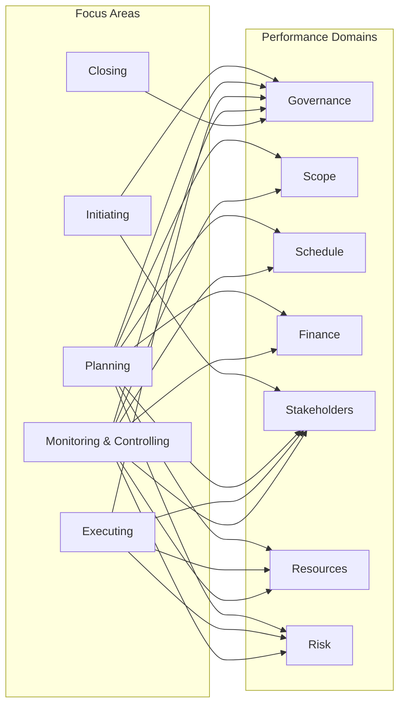

# Performance Domains Overview

Связь семи Performance Domains с группами процессов (Focus Areas) по [process-groups-to-domains](../reference/process-groups-to-domains.md).

## Mermaid: Domains and Focus Areas

## Processes per domain (summary)

| Domain       | Initiating | Planning | Executing | M&C | Closing |
|-------------|------------|----------|-----------|-----|--------|
| Governance  | 4.1        | 5.1      | 6.1       | 7.1, 7.2 | 8.1 |
| Scope       | —          | 5.2–5.5  | —         | 7.3, 7.4 | — |
| Schedule    | —          | 5.6–5.10 | —         | 7.5 | — |
| Finance     | —          | 5.11–5.13| —         | 7.6 | — |
| Stakeholders| 4.2        | 5.17, 5.24| 6.7, 6.10 | 7.9, 7.12 | — |
| Resources   | —          | 5.15, 5.16| 6.4–6.6  | 7.8 | — |
| Risk        | —          | 5.18–5.22| 6.8       | 7.10 | — |
